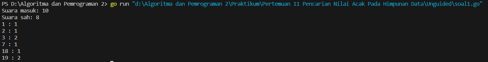

<h1 align="center" > Laporan Praktikum Modul 11 X Pencarian Nilai Acak Pada Himpunan Data</h1>

___

<p align="center">Julian Saputra - 103112400260</p>

___

## Guided

___

Soal 1
```go
package main

  

import "fmt"

  

func main() {

    n := 5

    data := []string{"sabun", "sampo", "odol", "tisu", "minyak"}

    X := "odol"

  

    found := false

    for i := 0; i < n; i++ {

        if data[i] == X {

            found = true

            break

        }

    }

  

    fmt.Println("Barang ditemukan:", found)

}
```

Output : 


Penjelasan : 
Program di atas mencari apakah barang "odol" ada dalam daftar lima barang: "sabun", "sampo", "odol", "tisu", dan "minyak". Program menggunakan perulangan untuk membandingkan tiap elemen dengan "odol". Jika ditemukan, variabel found diubah menjadi true dan perulangan dihentikan. Hasilnya ditampilkan dengan mencetak apakah barang ditemukan atau tidak.

Soal 2
```go
package main

  

import "fmt"

  

func main() {

    kalimat := "algoritma pemrograman"

    karakter := 'a'

  

    var indeks []int

  

    for i, c := range kalimat {

        if c == karakter {

            indeks = append(indeks, i)

        }

    }

  

    if len(indeks) > 0 {

        fmt.Print("Karakter ditemukan pada indeks : ")

        for i, idx := range indeks {

            if i > 0 {

                fmt.Print(", ")

            }

            fmt.Print(idx)

        }

        fmt.Println()

    } else {

        fmt.Println("Karakter tidak ditemukan.")

    }

}
```

Output : 


Penjelasan : 
Program di atas berfungsi untuk mencari semua posisi (indeks) kemunculan karakter a dalam string algoritma pemrograman. Program menggunakan perulangan for dengan range untuk menelusuri setiap karakter dalam string. Jika karakter yang ditemukan sama dengan a, indeksnya disimpan ke dalam slice indeks. Setelah pencarian selesai, program memeriksa apakah karakter ditemukan. Jika ya, semua indeks akan dicetak dalam satu baris, dipisahkan dengan koma. Jika tidak ada, program mencetak bahwa karakter tidak ditemukan.

Soal 3
```go
package main

  

import "fmt"

  

type Mahasiswa struct {

    nama string

    nim  string

}

  

func binarySearch(data []Mahasiswa, x string) int {

    low := 0                  

    high := len(data) - 1    

  

    for low <= high {

        mid := (low + high) / 2

  

        if data[mid].nim == x {

            return mid

        } else if data[mid].nim < x {

            low = mid + 1

        } else {

            high = mid - 1

        }

    }

  

    return -1

}

  

func main() {

    mahasiswa := []Mahasiswa{

        {"Andi", "220001"},

        {"Budi", "220002"},

        {"Citra", "220003"},

        {"Dina", "220004"},

    }

  

    X := "220003"

  

    index := binarySearch(mahasiswa, X)

  

    if index != -1 {

        fmt.Println("Indeks mahasiswa ditemukan:", index)

    } else {

        fmt.Println("NIM tidak ditemukan.")

    }

}
```

Output : 


___

## Unguided

___

Soal 1
```go
package main

  

import "fmt"

  

func main() {

    input := []int{7, 19, 3, 2, 78, 3, 1, -3, 18, 19, 0}

  

    var suaraMasuk int

    var suaraSah int

  

    var hitungSuara [21]int

  

    for i := 0; i < len(input); i++ {

        suara := input[i]

  

        if suara == 0 {

            break

        }

  

        suaraMasuk++

  

        if suara >= 1 && suara <= 20 {

            suaraSah++

            hitungSuara[suara] = hitungSuara[suara] + 1

        }

    }

  

    fmt.Printf("Suara masuk: %d\n", suaraMasuk)

    fmt.Printf("Suara sah: %d\n", suaraSah)

  

    for i := 1; i <= 20; i++ {

        if hitungSuara[i] > 0 {

            fmt.Printf("%d : %d\n", i, hitungSuara[i])

        }

    }

}
```

Output : 


Penjelasan : 
Program di atas digunakan untuk menghitung hasil pemungutan suara dari daftar angka yang diberikan. Nilai-nilai dalam slice input mewakili suara yang diberikan ke calon bernomor 1 hingga 20, dan angka 0 digunakan sebagai tanda akhir data suara.
Pertama, program mendeklarasikan variabel suaraMasuk untuk menghitung total suara yang masuk (hingga sebelum angka 0), dan suaraSah untuk menghitung suara yang sah (yaitu suara untuk calon bernomor 1 sampai 20). Program juga menggunakan array hitungSuara untuk menyimpan jumlah suara masing-masing calon.
Melalui perulangan, program memproses setiap elemen dalam input. Jika ditemukan angka 0, perulangan dihentikan. Jika angka berada dalam rentang 1–20, maka dianggap suara sah, dan nilai dalam array hitungSuara untuk calon tersebut akan bertambah satu.
Setelah semua suara diproses, program mencetak jumlah total suara yang masuk, jumlah suara sah, dan jumlah suara yang diterima masing-masing calon yang memperoleh suara.

Soal 2 
```go
package main

  

import "fmt"

  

func main() {

    input := []int{7, 19, 3, 2, 78, 3, 1, -3, 18, 19, 0}

    var suaraMasuk, suaraSah int

    var count [21]int

  

    for i := 0; i < len(input); i++ {

        if input[i] == 0 {

            break

        }

        suaraMasuk++

        if input[i] >= 1 && input[i] <= 20 {

            count[input[i]]++

            suaraSah++

        }

    }

  

    k1, k2 := 0, 0

    for i := 1; i <= 20; i++ {

        if count[i] > count[k1] || (count[i] == count[k1] && i < k1) {

            k2 = k1

            k1 = i

        } else if count[i] > count[k2] || (count[i] == count[k2] && i < k2 && i != k1) {

            k2 = i

        }

    }

  

    fmt.Println("Suara masuk:", suaraMasuk)

    fmt.Println("Suara sah:", suaraSah)

    fmt.Println("Ketua RT:", k1)

    fmt.Println("Wakil ketua:", k2)

}
```

Output : 


Penjelasan : 
Program ini mengolah array yang berisi suara masuk dalam pemilihan Ketua dan Wakil Ketua RT. Program pertama-tama menghitung jumlah suara yang masuk dan suara yang sah (angka antara 1 hingga 20), dengan menyimpan jumlah suara untuk setiap calon di array count. Kemudian, program mencari calon dengan suara terbanyak untuk posisi Ketua RT dan Wakil Ketua RT, dengan aturan bahwa jika suara sama, calon dengan nomor lebih kecil dipilih. Setelah itu, program menampilkan hasil berupa jumlah suara yang masuk, jumlah suara sah, serta calon terpilih sebagai Ketua RT dan Wakil Ketua RT.

Soal 3 
```go
package main

  

import "fmt"

  

const NMAX = 1000000

var data [NMAX]int

  

func isiArray(n int) {

    for i := 0; i < n; i++ {

        fmt.Scan(&data[i])

    }

}

  

func posisi(n, k int) int {

    for i := 0; i < n; i++ {

        if data[i] == k {

            return i

        }

    }

    return -1

}

  

func main() {

    var n, k int

    fmt.Scan(&n, &k)

  

    isiArray(n)

    idx := posisi(n, k)

  

    if idx == -1 {

        fmt.Println("TIDAK ADA")

    } else {

        fmt.Println(idx)

    }

}
```

Output : 


Penjelasan : 
Program ini digunakan untuk mencari posisi indeks pertama dari suatu nilai k dalam array yang diisi oleh pengguna. Pertama, program membaca dua input: ukuran array n dan nilai yang dicari k. Kemudian, program mengisi array data dengan n elemen yang dimasukkan oleh pengguna. Fungsi posisi mencari indeks pertama dari nilai k dalam array, dan jika ditemukan, program akan menampilkan indeks tersebut. Jika nilai k tidak ada dalam array, program akan menampilkan "TIDAK ADA". Program mengimplementasikan pencarian sederhana dengan memeriksa setiap elemen dalam array hingga nilai yang dicari ditemukan atau array habis.