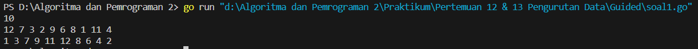
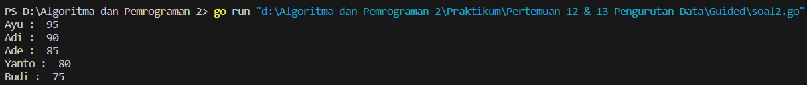
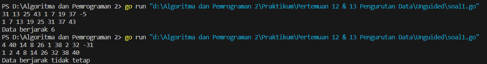
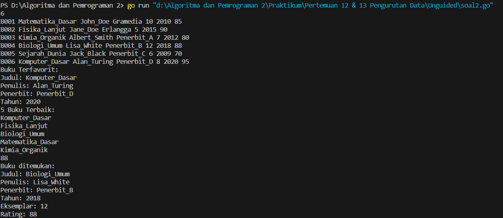

<h1 align="center" > Laporan Praktikum Modul 12 & 13 X Pengurutan Data</h1>

___

<p align="center">Julian Saputra - 103112400260</p>

___

## Guided

___

Soal 1 : 
```go
package main

  

import "fmt"

  

func selectionSortAsc(arr []int) {

    n := len(arr)

    for i := 0; i < n; i++ {

        minIdx := i

        for j := i + 1; j < n; j++ {

            if arr[j] < arr[minIdx] {

                minIdx = j

            }

        }

        arr[i], arr[minIdx] = arr[minIdx], arr[i]

    }

}

  

func selectionSortDesc(arr []int) {

    n := len(arr)

    for i := 0; i < n; i++ {

        maxIdx := i

        for j := i + 1; j < n; j++ {

            if arr[j] > arr[maxIdx] {

                maxIdx = j

            }

        }

        arr[i], arr[maxIdx] = arr[maxIdx], arr[i]

    }

}

  

func main() {

    var n int

    fmt.Scan(&n)

  

    arr := make([]int, n)

    for i := 0; i < n; i++ {

        fmt.Scan(&arr[i])

    }

  

    var ganjil []int

    var genap []int

  

    for i := 0; i < n; i++ {

        if arr[i]%2 == 1 {

            ganjil = append(ganjil, arr[i])

        } else {

            genap = append(genap, arr[i])

        }

    }

  

    selectionSortAsc(ganjil)

    selectionSortDesc(genap)

  

    for i := 0; i < len(ganjil); i++ {

        fmt.Printf("%d ", ganjil[i])

    }

  

    for i := 0; i < len(genap); i++ {

        fmt.Printf("%d ", genap[i])

    }

  

    fmt.Println()

}
```

Output : 


Penjelasan  :
Program di atas berfungsi untuk mengurutkan bilangan berdasarkan jenisnya yaitu bilangan ganjil dan bilangan genap. Pertama program meminta pengguna memasukkan sebuah bilangan bulat n yang menyatakan banyaknya data yang akan dimasukkan. Setelah itu program membaca n buah bilangan dan menyimpannya dalam sebuah array arr. Selanjutnya program memisahkan bilangan-bilangan tersebut ke dalam dua array terpisah satu untuk bilangan ganjil yaitu ganjil dan satu lagi untuk bilangan genap yaitu genap. Pemisahan ini dilakukan dengan mengecek setiap elemen array arr, jika bilangan tersebut ganjil maka akan dimasukkan ke array ganjil sedangkan jika genap akan dimasukkan ke array genap.
Setelah semua bilangan dipisahkan program mengurutkan array ganjil dengan fungsi selectionSortAsc yang menggunakan metode selection sort untuk mengurutkan elemen dari nilai terkecil ke nilai terbesar. Untuk array genap program menggunakan fungsi selectionSortDesc yang juga menggunakan metode selection sort tetapi mengurutkan elemen dari nilai terbesar ke nilai terkecil. Setelah proses pengurutan selesai program mencetak semua elemen ganjil yang sudah terurut menaik terlebih dahulu lalu mencetak semua elemen genap yang sudah terurut menurun dengan setiap elemen dipisahkan oleh spasi. Akhirnya program mencetak baris kosong sebagai tanda akhir output. Secara keseluruhan program ini memproses data dengan cara sederhana tanpa menggunakan struktur perulangan for range dan fokus pada manipulasi array berdasarkan kategori ganjil dan genap.

Soal 2 : 
```go
package main

  

import "fmt"

  

type identitas struct {

    nama  string

    nilai int

}

  

func nilaiujian(arr []identitas) {

    var temp identitas

    for i := 1; i < len(arr); i++ {

        temp = arr[i]

        j := i

  

        for j > 0 && temp.nilai > arr[j-1].nilai {

            arr[j] = arr[j-1]

            j--

        }

  

        arr[j] = temp

    }

}

  

func main() {

    orang := []identitas{

        {"Budi", 75},

        {"Adi", 90},

        {"Ade", 85},

        {"Ayu", 95},

        {"Yanto", 80},

    }

  

    nilaiujian(orang)

  

    for i := 0; i < len(orang); i++ {

        fmt.Println(orang[i].nama, ": ", orang[i].nilai)

    }

}
```

output  :


Penjelasan : 
Program di atas digunakan untuk mengurutkan data beberapa orang berdasarkan nilai ujian mereka dari nilai tertinggi ke nilai terendah. Pertama program mendefinisikan sebuah tipe data baru bernama identitas yang terdiri dari dua properti yaitu nama bertipe string dan nilai bertipe integer. Kemudian terdapat fungsi bernama nilaiujian yang menerima parameter berupa array bertipe identitas. Di dalam fungsi nilaiujian digunakan algoritma insertion sort untuk mengurutkan data berdasarkan nilai secara menurun. Prosesnya dimulai dari elemen kedua array kemudian elemen tersebut dibandingkan dengan elemen sebelumnya dan terus digeser ke kiri jika nilai yang dibandingkan lebih kecil dari nilai elemen yang sedang diproses sehingga elemen dengan nilai lebih besar akan berada di depan.
Pada fungsi main dibuat sebuah array orang yang berisi beberapa data identitas seperti nama dan nilai ujian masing-masing. Data orang tersebut kemudian dikirim ke fungsi nilaiujian untuk diurutkan. Setelah proses pengurutan selesai program mencetak hasil pengurutan ke layar dengan menampilkan nama dan nilai setiap orang. Setiap nama dan nilai dicetak dalam satu baris. Program ini secara keseluruhan bertujuan untuk menampilkan daftar nama peserta ujian berdasarkan urutan nilai tertinggi ke nilai terendah menggunakan metode insertion sort sederhana.

____

## Unguided 

___

Soal 1 : 
```go
package main

  

import "fmt"

  

func main() {

    var data []int

    var x int

  

    for {

        fmt.Scan(&x)

        if x < 0 {

            break

        }

        data = append(data, x)

    }

  

    for i := 1; i < len(data); i++ {

        temp := data[i]

        j := i - 1

        for j >= 0 && data[j] > temp {

            data[j+1] = data[j]

            j--

        }

        data[j+1] = temp

    }

  

    for i := 0; i < len(data); i++ {

        fmt.Printf("%d ", data[i])

    }

    fmt.Println()

  

    if len(data) < 2 {

        fmt.Println("Data berjarak tidak tetap")

        return

    }

  

    jarak := data[1] - data[0]

    sama := true

    for i := 1; i < len(data)-1; i++ {

        if data[i+1]-data[i] != jarak {

            sama = false

            break

        }

    }

  

    if sama {

        fmt.Printf("Data berjarak %d\n", jarak)

    } else {

        fmt.Println("Data berjarak tidak tetap")

    }

}
```

output : 


Penjelasan :
Program ini berfungsi untuk membaca sekumpulan bilangan bulat dari pengguna, kemudian mengurutkan bilangan tersebut, menampilkannya, serta memeriksa apakah bilangan-bilangan tersebut memiliki jarak yang tetap satu sama lain. Pertama, program mendeklarasikan slice data untuk menyimpan input dan variabel x untuk menampung sementara setiap angka yang diinputkan. Melalui perulangan tak hingga, program menerima input angka satu per satu menggunakan fungsi fmt.Scan lalu menghentikan proses input jika angka yang dimasukkan bernilai negatif. Setiap angka positif yang diterima akan disimpan ke dalam slice data.
Setelah semua data terkumpul, program mengurutkan angka-angka tersebut secara ascending menggunakan algoritma insertion sort yaitu dengan membandingkan setiap elemen dengan elemen-elemen sebelumnya dan menyisipkannya pada posisi yang tepat. Setelah data diurutkan, program menampilkan semua elemen data dalam satu baris yang dipisahkan oleh spasi. Selanjutnya, program melakukan pemeriksaan apakah data memiliki jarak tetap antar elemennya. Jika jumlah elemen kurang dari dua, program langsung menyimpulkan bahwa data tidak berjarak tetap. Jika ada cukup elemen, program menghitung selisih atau jarak antara elemen pertama dan kedua lalu memeriksa apakah seluruh pasangan elemen berikutnya memiliki selisih yang sama. Bila seluruh jarak konsisten, program akan mencetak bahwa data berjarak tetap dengan nilai jaraknya sedangkan bila ada ketidaksesuaian program akan menampilkan pesan bahwa data berjarak tidak tetap.

Soal 2 :
```go
package main

  

import "fmt"

  

const nMax = 7919

  

type Buku struct {

    id        string

    judul     string

    penulis   string

    penerbit  string

    eksemplar int

    tahun     int

    rating    int

}

  

func DaftarkanBuku(pustaka *[nMax]Buku, n *int) {

    fmt.Scan(n)

    for i := 0; i < *n; i++ {

        fmt.Scan(&pustaka[i].id)

        fmt.Scan(&pustaka[i].judul)

        fmt.Scan(&pustaka[i].penulis)

        fmt.Scan(&pustaka[i].penerbit)

        fmt.Scan(&pustaka[i].eksemplar)

        fmt.Scan(&pustaka[i].tahun)

        fmt.Scan(&pustaka[i].rating)

    }

}

  

func CetakTerfavorit(pustaka [nMax]Buku, n int) {

    if n == 0 {

        fmt.Println("Tidak ada buku.")

        return

    }

    maxRating := pustaka[0].rating

    idx := 0

    for i := 1; i < n; i++ {

        if pustaka[i].rating > maxRating {

            maxRating = pustaka[i].rating

            idx = i

        }

    }

    fmt.Println("Buku Terfavorit:")

    fmt.Println("Judul:", pustaka[idx].judul)

    fmt.Println("Penulis:", pustaka[idx].penulis)

    fmt.Println("Penerbit:", pustaka[idx].penerbit)

    fmt.Println("Tahun:", pustaka[idx].tahun)

}

  

func UrutBuku(pustaka *[nMax]Buku, n int) {

    for i := 1; i < n; i++ {

        temp := pustaka[i]

        j := i - 1

        for j >= 0 && pustaka[j].rating < temp.rating {

            pustaka[j+1] = pustaka[j]

            j--

        }

        pustaka[j+1] = temp

    }

}

  

func Cetak5Terbaru(pustaka [nMax]Buku, n int) {

    fmt.Println("5 Buku Terbaik:")

    if n < 5 {

        for i := 0; i < n; i++ {

            fmt.Println(pustaka[i].judul)

        }

    } else {

        for i := 0; i < 5; i++ {

            fmt.Println(pustaka[i].judul)

        }

    }

}

  

func CariBuku(pustaka [nMax]Buku, n int, r int) {

    kiri := 0

    kanan := n - 1

    ketemu := false

  

    for kiri <= kanan {

        tengah := (kiri + kanan) / 2

        if pustaka[tengah].rating == r {

            ketemu = true

            fmt.Println("Buku ditemukan:")

            fmt.Println("Judul:", pustaka[tengah].judul)

            fmt.Println("Penulis:", pustaka[tengah].penulis)

            fmt.Println("Penerbit:", pustaka[tengah].penerbit)

            fmt.Println("Tahun:", pustaka[tengah].tahun)

            fmt.Println("Eksemplar:", pustaka[tengah].eksemplar)

            fmt.Println("Rating:", pustaka[tengah].rating)

            break

        } else if pustaka[tengah].rating < r {

            kanan = tengah - 1

        } else {

            kiri = tengah + 1

        }

    }

  

    if !ketemu {

        fmt.Println("Tidak ada buku dengan rating seperti itu.")

    }

}

  

func main() {

    var pustaka [nMax]Buku

    var nPustaka int

    var ratingCari int

  

    DaftarkanBuku(&pustaka, &nPustaka)

  

    CetakTerfavorit(pustaka, nPustaka)

  

    UrutBuku(&pustaka, nPustaka)

  

    Cetak5Terbaru(pustaka, nPustaka)

  

    fmt.Scan(&ratingCari)

  

    CariBuku(pustaka, nPustaka, ratingCari)

}
```

output :


Penjelasan : 
Program ini mengelola data buku. Pertama, pengguna mendaftarkan sejumlah buku dengan mengisi atribut seperti id, judul, penulis, penerbit, jumlah eksemplar, tahun, dan rating. Setelah semua buku dimasukkan, program mencari dan menampilkan buku dengan rating tertinggi. Kemudian, semua buku diurutkan berdasarkan rating dari yang tertinggi ke terendah. Setelah itu, program mencetak lima judul buku dengan rating terbaik. Terakhir, program memungkinkan pengguna mencari buku berdasarkan rating menggunakan metode binary search dan menampilkan data buku tersebut jika ditemukan.