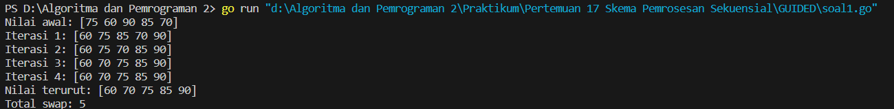
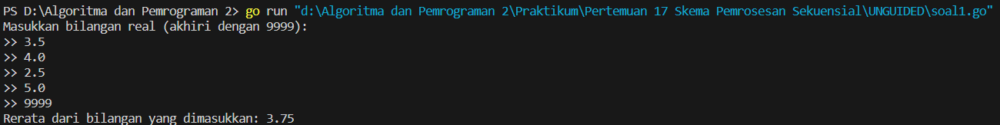
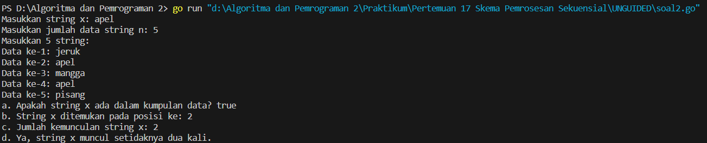
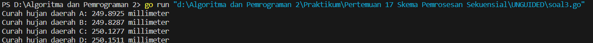
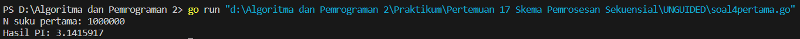
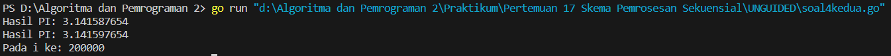
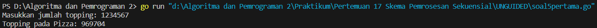
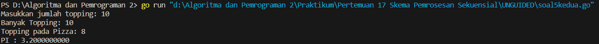

<h1 align="center" > Laporan Praktikum Modul 17 X Skema Pemrosesan Sekuensial</h1>

___

<p align="center">Julian Saputra - 103112400260</p>

___

## Guided


___

Soal 1 :
```go
package main

  

import "fmt"

  

func main() {

    data := []int{75, 60, 90, 85, 70}

    swapCount := 0

  

    fmt.Println("Nilai awal:", data)

    for i := 0; i < len(data)-1; i++ {

        for j := 0; j < len(data)-i-1; j++ {

            if data[j] > data[j+1] {

                data[j], data[j+1] = data[j+1], data[j]

                swapCount++

            }

        }

        fmt.Printf("Iterasi %d: %v\n", i+1, data)

    }

    fmt.Println("Nilai terurut:", data)

    fmt.Println("Total swap:",swapCount)

}
```

Output : 


Penjelasan : 
Program ini berfungsi untuk mengurutkan elemen dalam slice data menggunakan algoritma bubble sort, serta menghitung berapa kali pertukaran (swap) terjadi selama proses pengurutan. Program dimulai dengan mendeklarasikan slice data yang berisi lima nilai integer, lalu sebuah variabel swapCount untuk menghitung jumlah pertukaran. Kemudian, dilakukan dua perulangan bersarang: perulangan luar (i) menentukan jumlah iterasi sebanyak n-1 kali (dengan n adalah jumlah elemen), dan perulangan dalam (j) membandingkan dua elemen berurutan dalam slice. Jika elemen ke-j lebih besar dari elemen ke-j+1, maka keduanya ditukar dan nilai swapCount ditambah satu. Setelah setiap iterasi luar, program mencetak kondisi sementara dari slice data. Setelah semua iterasi selesai, hasil akhir slice yang sudah terurut dicetak bersama dengan total jumlah pertukaran yang terjadi selama proses. Program ini berguna untuk memahami cara kerja bubble sort secara visual dan menghitung efisiensi dalam hal jumlah pertukaran.

___

## Unguided

___

Soal 1 : 
```go
package main

  

import "fmt"

  

func main() {

    var number float64

    var sum float64

    var count int

  

    fmt.Println("Masukkan bilangan real (akhiri dengan 9999):")

    for {

        fmt.Print(">> ")

        fmt.Scan(&number)

  

        if number == 9999 {

            break

        }

  

        sum += number

        count++

    }

  

    if count > 0 {

        rerata := sum / float64(count)

        fmt.Printf("Rerata dari bilangan yang dimasukkan: %.2f\n", rerata)

    } else {

        fmt.Println("Tidak ada bilangan yang dimasukkan.")

    }

}
```

Output :


Penjelasan : 
Program ini berfungsi untuk menghitung rata-rata dari sekumpulan bilangan real yang dimasukkan oleh pengguna, dengan proses input dihentikan ketika pengguna memasukkan angka 9999. Program dimulai dengan mendeklarasikan tiga variabel: number bertipe float64 untuk menyimpan input sementara dari pengguna, sum untuk menjumlahkan semua bilangan yang dimasukkan, dan count untuk menghitung berapa banyak bilangan yang dimasukkan. Program mencetak instruksi kepada pengguna agar memasukkan bilangan real, lalu masuk ke dalam perulangan tak hingga dengan for untuk membaca input secara terus-menerus. Jika nilai yang dimasukkan adalah 9999, maka perulangan dihentikan dengan break. Setiap bilangan yang valid akan ditambahkan ke sum, dan count akan bertambah satu. Setelah perulangan selesai, program memeriksa apakah count lebih dari nol. Jika ya, maka dihitung rata-rata dengan membagi sum oleh count dan hasilnya ditampilkan dengan dua angka di belakang koma. Jika tidak ada bilangan yang dimasukkan, maka program akan menampilkan pesan bahwa tidak ada input yang diberikan. Program ini berguna untuk memproses data input numerik dengan batasan nilai penghenti tertentu.

Soal 2 : 
```go
package main

  

import "fmt"

  

func main() {

    var x string

    var n int

  

    fmt.Print("Masukkan string x: ")

    fmt.Scan(&x)

  

    fmt.Print("Masukkan jumlah data string n: ")

    fmt.Scan(&n)

  

    strings := make([]string, n)

    fmt.Println("Masukkan", n, "string:")

  

    for i := 0; i < n; i++ {

        fmt.Printf("Data ke-%d: ", i+1)

        fmt.Scan(&strings[i])

    }

  

    found := false

    for _, s := range strings {

        if s == x {

            found = true

            break

        }

    }

    fmt.Println("a. Apakah string x ada dalam kumpulan data?", found)

  

    pos := -1

    for i, s := range strings {

        if s == x {

            pos = i + 1

            break

        }

    }

    if pos != -1 {

        fmt.Println("b. String x ditemukan pada posisi ke:", pos)

    } else {

        fmt.Println("b. String x tidak ditemukan.")

    }

  

    count := 0

    for _, s := range strings {

        if s == x {

            count++

        }

    }

    fmt.Println("c. Jumlah kemunculan string x:", count)

  

    if count >= 2 {

        fmt.Println("d. Ya, string x muncul setidaknya dua kali.")

    } else {

        fmt.Println("d. Tidak, string x tidak muncul dua kali atau lebih.")

    }

}
```

Output : 


Penjelasan : 
Program ini berfungsi untuk memeriksa keberadaan sebuah string x dalam sekumpulan data string yang dimasukkan oleh pengguna, serta menampilkan beberapa informasi terkait string tersebut. Program dimulai dengan meminta input string x dan jumlah data string n, lalu membuat slice untuk menampung n string yang dimasukkan pengguna. Setelah itu, program memeriksa apakah string x ada dalam kumpulan data, mencetak hasilnya sebagai nilai benar atau salah. Kemudian, program mencari posisi pertama kemunculan string x dan mencetak posisinya jika ditemukan. Selanjutnya, program menghitung berapa kali string x muncul dalam data dan menampilkan jumlah tersebut. Terakhir, program memeriksa apakah string x muncul setidaknya dua kali dan mencetak pernyataan yang sesuai. Program ini memperlihatkan penggunaan slice, perulangan, dan percabangan dalam pengolahan data string.

Soal 3 : 
```go
package main

  

import (

    "fmt"

    "math/rand"

)

  

func main() {

    const totalDrops = 10000000

    const dropVolume = 0.0001

    var a, b, c, d int

  

    rand.Seed(1)

  

    for i := 0; i < totalDrops; i++ {

        x := rand.Float64()

        y := rand.Float64()

  

        if x < 0.5 && y < 0.5 {

            a++

        } else if x >= 0.5 && y < 0.5 {

            b++

        } else if x >= 0.5 && y >= 0.5 {

            c++

        } else if x < 0.5 && y >= 0.5 {

            d++

        }

    }

  

    fmt.Printf("Curah hujan daerah A: %.4f millimeter\n", float64(a)*dropVolume)

    fmt.Printf("Curah hujan daerah B: %.4f millimeter\n", float64(b)*dropVolume)

    fmt.Printf("Curah hujan daerah C: %.4f millimeter\n", float64(c)*dropVolume)

    fmt.Printf("Curah hujan daerah D: %.4f millimeter\n", float64(d)*dropVolume)

}
```

Output : 


Penjelasan : 
Program ini digunakan untuk mensimulasikan curah hujan di empat wilayah berbeda yang dibagi berdasarkan koordinat bidang kartesius. Program menetapkan jumlah total tetesan hujan sebanyak sepuluh juta dan volume setiap tetesan sebesar nol koma nol nol nol satu millimeter. Dengan menggunakan fungsi acak dari paket math rand, program menghasilkan koordinat acak x dan y antara nol hingga satu untuk setiap tetesan hujan. Berdasarkan nilai x dan y, tetesan dikategorikan ke dalam salah satu dari empat wilayah yaitu A untuk kuadran kiri bawah, B untuk kanan bawah, C untuk kanan atas, dan D untuk kiri atas. Setiap wilayah dihitung jumlah tetesan yang jatuh di dalamnya, lalu dikalikan dengan volume tetesan untuk mendapatkan curah hujan total di masing-masing wilayah. Hasil curah hujan ditampilkan dalam satuan millimeter dengan empat angka di belakang koma. Program ini menunjukkan bagaimana simulasi menggunakan angka acak dapat digunakan untuk memperkirakan distribusi suatu fenomena fisik seperti curah hujan.

Soal 4 pertama : 
```go
package main

  

import "fmt"

  

func main() {

    var N int

    fmt.Print("N suku pertama: ")

    fmt.Scan(&N)

  

    pi := 0.0

    for i := 0; i < N; i++ {

        term := 1.0 / float64(2*i+1)

        if i%2 == 1 {

            term = -term

        }

        pi += term

    }

  

    pi *= 4

    fmt.Printf("Hasil PI: %.7f\n", pi)

}
```

Output : 


Penjelasan : 
Program ini digunakan untuk menghitung pendekatan nilai konstanta pi menggunakan deret Leibniz. Program meminta input dari pengguna berupa N yaitu jumlah suku pertama yang akan dihitung. Variabel pi diinisialisasi dengan nol, lalu dilakukan perulangan sebanyak N kali. Pada setiap iterasi, program menghitung nilai suku berdasarkan rumus 1 dibagi dengan 2i tambah 1, di mana i adalah indeks iterasi yang dimulai dari nol. Jika nilai i ganjil maka suku tersebut diberi tanda negatif sesuai dengan pola deret Leibniz yang berselang-seling positif dan negatif. Setiap suku ditambahkan ke dalam variabel pi. Setelah seluruh suku dijumlahkan, hasil akhirnya dikalikan dengan empat untuk memperoleh pendekatan nilai pi, kemudian ditampilkan dengan tujuh angka di belakang koma. Program ini menunjukkan bagaimana pendekatan terhadap nilai pi dapat dihitung secara numerik dengan menggunakan konsep deret tak hingga.

Soal 4 Kedua : 
```go
package main

  

import "fmt"

  

func main() {

    pi := 0.0

    prevPi := 0.0

    i := 0

  

    for {

        term := 1.0 / float64(2*i+1)

        if i%2 == 1 {

            term = -term

        }

        pi += term

  

        piTimes4 := pi * 4

        prevPiTimes4 := prevPi * 4

  

        diff := piTimes4 - prevPiTimes4

        if diff < 0 {

            diff = -diff

        }

  

        if i > 0 && diff < 0.00001 {

            fmt.Printf("Hasil PI: %.9f\n", prevPiTimes4)

            fmt.Printf("Hasil PI: %.9f\n", piTimes4)

            fmt.Printf("Pada i ke: %d\n", i)

            break

        }

  

        prevPi = pi

        i++

    }

}
```

Output : 


Penjelasan : 
Program ini digunakan untuk menghitung nilai pendekatan dari konstanta pi menggunakan deret Leibniz. Deret ini menyatakan bahwa pi/4 adalah jumlah dari deret tak hingga dengan pola 1 - 1/3 + 1/5 - 1/7 + 1/9 dan seterusnya. Program memulai dengan inisialisasi nilai pi, prevPi, dan indeks i ke nol. Dalam perulangan tak hingga, program menghitung satu suku dari deret berdasarkan nilai i. Jika nilai i ganjil, suku tersebut diberi tanda negatif. Suku ini ditambahkan ke nilai pi, kemudian nilai pi dikalikan dengan 4 untuk mendekati nilai pi sebenarnya. Selisih antara nilai pi saat ini dan sebelumnya disimpan dalam variabel diff. Jika selisih absolut antara dua hasil pi yang berurutan kurang dari 0.00001, program menganggap pendekatan sudah cukup akurat, lalu mencetak hasil pendekatan sebelumnya, hasil pendekatan saat ini, dan nilai i saat pendekatan tersebut dicapai, kemudian keluar dari perulangan. Tujuan utama dari program ini adalah memperkirakan nilai pi dengan akurasi tertentu menggunakan metode numerik sederhana.

Soal 5 pertama : 
```go
package main

  

import (

    "fmt"

    "math"

    "math/rand"

    "time"

)

  

func hitungToppingPadaPizza(jumlahTopping int) int {

    rand.Seed(time.Now().UnixNano())

    dalamPizza := 0

  

    for i := 0; i < jumlahTopping; i++ {

        x := rand.Float64()

        y := rand.Float64()

        if math.Pow(x-0.5, 2)+math.Pow(y-0.5, 2) <= 0.25 {

            dalamPizza++

        }

    }

    return dalamPizza

}

  

func main() {

    var jumlahTopping int

    fmt.Print("Masukkan jumlah topping: ")

    fmt.Scan(&jumlahTopping)

  

    dalamPizza := hitungToppingPadaPizza(jumlahTopping)

    fmt.Printf("Topping pada Pizza: %d\n", dalamPizza)

}
```

Output :


Penjelasan : 
Program di atas ditulis dalam bahasa Go dan mensimulasikan metode Monte Carlo untuk memperkirakan berapa banyak topping yang jatuh di atas permukaan bulat sebuah pizza. Program meminta pengguna untuk memasukkan jumlah topping yang akan dijatuhkan secara acak di atas bidang datar berukuran satuan. Fungsi hitungToppingPadaPizza menerima jumlah topping sebagai parameter, kemudian menggunakan generator angka acak untuk menentukan posisi setiap topping dalam koordinat x dan y. Dengan menggeser pusat lingkaran ke titik (0.5, 0.5), program memeriksa apakah titik tersebut berada di dalam lingkaran dengan jari-jari 0.5 menggunakan persamaan lingkaran. Jika ya, maka topping dianggap berada di atas pizza dan dihitung. Akhirnya, jumlah topping yang berada di atas pizza ditampilkan ke layar. Program ini menggambarkan cara sederhana untuk melakukan simulasi distribusi acak dan mengevaluasi seberapa banyak yang jatuh di area tertentu menggunakan konsep geometri dasar.

Soal 5 kedua : 
```go
package main

  

import (

    "fmt"

    "math"

    "math/rand"

    "time"

)

  

func main() {

    var jumlahTopping int

    fmt.Print("Masukkan jumlah topping: ")

    fmt.Scan(&jumlahTopping)

  

    rand.Seed(time.Now().UnixNano())

  

    dalamPizza := 0

    for i := 0; i < jumlahTopping; i++ {

        x := rand.Float64()

        y := rand.Float64()

        if math.Pow(x-0.5, 2)+math.Pow(y-0.5, 2) <= 0.25 {

            dalamPizza++

        }

    }

  

    pi := 4.0 * float64(dalamPizza) / float64(jumlahTopping)

  

    fmt.Printf("Banyak Topping: %d\n", jumlahTopping)

    fmt.Printf("Topping pada Pizza: %d\n", dalamPizza)

    fmt.Printf("PI : %.10f\n", pi)

}
```

Output : 


Penjelasan : 
Program ini menggunakan metode Monte Carlo untuk memperkirakan nilai pi berdasarkan simulasi peletakan topping secara acak di atas pizza berbentuk lingkaran. Program meminta input dari pengguna untuk jumlah topping yang akan dijatuhkan secara acak. Fungsi rand.Float64() digunakan untuk menghasilkan angka acak antara 0 dan 1 yang mewakili posisi x dan y dari topping di atas bidang persegi satuan. Pusat lingkaran pizza ditempatkan di koordinat (0.5, 0.5) dengan jari-jari 0.5, sehingga titik berada di dalam lingkaran jika memenuhi persamaan (x-0.5)^2 + (y-0.5)^2 <= 0.25. Setiap kali topping jatuh di dalam lingkaran, variabel dalamPizza dihitung. Setelah selesai, nilai pi diperkirakan dengan rumus pi = 4 * (dalamPizza / jumlahTopping), yang didasarkan pada perbandingan antara jumlah topping yang jatuh di dalam pizza dengan total topping yang dijatuhkan. Hasilnya kemudian dicetak di layar, termasuk jumlah topping, topping yang jatuh di dalam pizza, dan nilai pi yang diperkirakan. Program ini adalah contoh penerapan simulasi acak untuk memperkirakan nilai matematika.