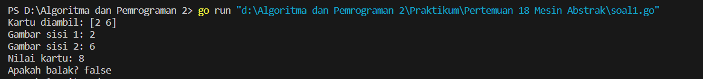
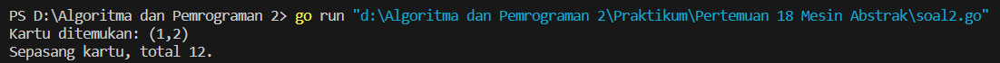
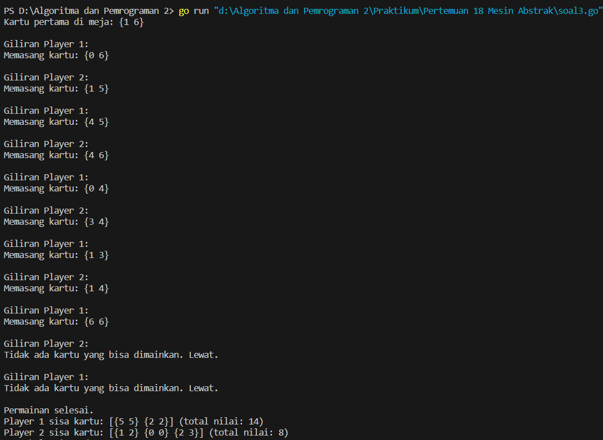
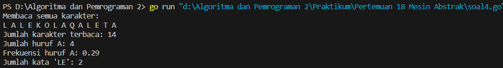

<h1 align="center" > Laporan Praktikum Modul 18 X Mesin Abstrak</h1>

___

<p align="center">Julian Saputra - 103112400260</p>

___

Soal 1 : 
```go
package main

  

import (

    "fmt"

    "math/rand"

    "time"

)

  

type Domino struct {

    Suit    [2]int

    IsBalak bool

}

  

type Dominoes struct {

    Cards     [28]Domino

    Remaining int

}

  

func buatSetKartu() Dominoes {

    var d Dominoes

    index := 0

    for i := 0; i <= 6; i++ {

        for j := i; j <= 6; j++ {

            d.Cards[index] = Domino{

                Suit:    [2]int{i, j},

                IsBalak: i == j,

            }

            index++

        }

    }

    d.Remaining = 28

    return d

}

  

func kocokKartu(d *Dominoes) {

    rand.Seed(time.Now().UnixNano())

    for i := range d.Cards {

        j := rand.Intn(len(d.Cards))

        d.Cards[i], d.Cards[j] = d.Cards[j], d.Cards[i]

    }

    d.Remaining = 28

}

  

func ambilKartu(d *Dominoes) Domino {

    if d.Remaining == 0 {

        return Domino{}

    }

    d.Remaining--

    return d.Cards[d.Remaining]

}

  

func gambarKartu(k Domino, suit int) int {

    if suit == 0 {

        return k.Suit[0]

    } else {

        return k.Suit[1]

    }

}

  

func nilaiKartu(k Domino) int {

    return k.Suit[0] + k.Suit[1]

}

  

func main() {

    d := buatSetKartu()

    kocokKartu(&d)

  

    kartu := ambilKartu(&d)

    fmt.Println("Kartu diambil:", kartu.Suit)

    fmt.Println("Gambar sisi 1:", gambarKartu(kartu, 0))

    fmt.Println("Gambar sisi 2:", gambarKartu(kartu, 1))

    fmt.Println("Nilai kartu:", nilaiKartu(kartu))

    fmt.Println("Apakah balak?", kartu.IsBalak)

}
```

Output : 


Penjelasan : 
Program ini membuat satu set kartu domino berjumlah 28 kartu dengan nilai dari 0 sampai 6. Setiap kartu punya dua angka dan ada tanda khusus kalau kedua angkanya sama (balak). Program mengocok kartu supaya urutannya acak, lalu mengambil satu kartu dari tumpukan. Setelah itu, program menampilkan nilai dua sisi kartu yang diambil, total nilainya, dan apakah kartu itu balak atau bukan. Jadi, kode ini mensimulasikan proses membuat, mengacak, dan mengambil kartu domino secara sederhana.

Soal 2 :
```go
package main

  

import "fmt"

  

type Domino struct {

    Suit1 int

    Suit2 int

}

  

func galiKartu(tumpukan []Domino, target Domino) (Domino, bool) {

    for _, kartu := range tumpukan {

        if kartu.Suit1 == target.Suit1 || kartu.Suit2 == target.Suit1 ||

            kartu.Suit1 == target.Suit2 || kartu.Suit2 == target.Suit2 {

            return kartu, true

        }

    }

    return Domino{}, false

}

  

func sepasangKartu(k1, k2 Domino) bool {

    total := k1.Suit1 + k1.Suit2 + k2.Suit1 + k2.Suit2

    return total == 12

}

  

func main() {

    tumpukan := []Domino{

        {1, 2},

        {3, 4},

        {5, 6},

        {6, 6},

    }

  

    target := Domino{6, 2}

  

    kartuDitemukan, ditemukan := galiKartu(tumpukan, target)

    if ditemukan {

        fmt.Printf("Kartu ditemukan: (%d,%d)\n", kartuDitemukan.Suit1, kartuDitemukan.Suit2)

    } else {

        fmt.Println("Kartu tidak ditemukan.")

    }

  

    k1 := Domino{6, 2}

    k2 := Domino{2, 2}

    if sepasangKartu(k1, k2) {

        fmt.Println("Sepasang kartu, total 12.")

    } else {

        fmt.Println("Bukan sepasang kartu.")

    }

}
```

Output : 


Penjelasan : 
Program ini membuat kumpulan kartu domino dan mencari kartu di dalamnya yang punya angka sama dengan salah satu sisi kartu target. Kalau ditemukan, kartu itu ditampilkan. Selain itu, kode juga memeriksa apakah dua kartu domino jumlah angka di kedua kartunya sama dengan 12. Jika iya, program bilang itu sepasang kartu. Jadi, program ini untuk mencari kartu yang cocok dan cek apakah dua kartu jumlahnya 12.

Soal 3 :
```go
package main

  

import (

    "fmt"

    "math/rand"

    "time"

)

  

type Domino struct {

    Suit1 int

    Suit2 int

}

  

type Player struct {

    Name  string

    Cards []Domino

}

  

func isPlayable(card Domino, left, right int) bool {

    return card.Suit1 == left || card.Suit2 == left || card.Suit1 == right || card.Suit2 == right

}

  

func findPlayable(cards []Domino, left, right int) (Domino, int, bool) {

    for i, c := range cards {

        if isPlayable(c, left, right) {

            return c, i, true

        }

    }

    return Domino{}, -1, false

}

  

func totalValue(cards []Domino) int {

    total := 0

    for _, c := range cards {

        total += c.Suit1 + c.Suit2

    }

    return total

}

  

func main() {

    rand.Seed(time.Now().UnixNano())

  

    var deck []Domino

    for i := 0; i <= 6; i++ {

        for j := i; j <= 6; j++ {

            deck = append(deck, Domino{i, j})

        }

    }

    rand.Shuffle(len(deck), func(i, j int) { deck[i], deck[j] = deck[j], deck[i] })

  

    player1 := Player{"Player 1", deck[:7]}

    player2 := Player{"Player 2", deck[7:14]}

    deck = deck[14:]

  

    board := []Domino{}

    currentPlayer := &player1

    otherPlayer := &player2

  

    board = append(board, deck[0])

    leftEnd := board[0].Suit1

    rightEnd := board[0].Suit2

    deck = deck[1:]

  

    fmt.Println("Kartu pertama di meja:", board[0])

  

    skipCount := 0

    for {

        fmt.Printf("\nGiliran %s:\n", currentPlayer.Name)

        card, index, ok := findPlayable(currentPlayer.Cards, leftEnd, rightEnd)

        if ok {

            currentPlayer.Cards = append(currentPlayer.Cards[:index], currentPlayer.Cards[index+1:]...)

            if card.Suit1 == leftEnd {

                board = append([]Domino{card}, board...)

                leftEnd = card.Suit2

            } else if card.Suit2 == leftEnd {

                board = append([]Domino{card}, board...)

                leftEnd = card.Suit1

            } else if card.Suit1 == rightEnd {

                board = append(board, card)

                rightEnd = card.Suit2

            } else {

                board = append(board, card)

                rightEnd = card.Suit1

            }

            fmt.Println("Memasang kartu:", card)

            skipCount = 0

        } else {

            fmt.Println("Tidak ada kartu yang bisa dimainkan. Lewat.")

            skipCount++

            if skipCount >= 2 {

                break

            }

        }

  

        if len(currentPlayer.Cards) == 0 {

            fmt.Printf("\n%s menang karena kehabisan kartu!\n", currentPlayer.Name)

            break

        }

  

        currentPlayer, otherPlayer = otherPlayer, currentPlayer

    }

  

    fmt.Println("\nPermainan selesai.")

    fmt.Printf("%s sisa kartu: %v (total nilai: %d)\n", player1.Name, player1.Cards, totalValue(player1.Cards))

    fmt.Printf("%s sisa kartu: %v (total nilai: %d)\n", player2.Name, player2.Cards, totalValue(player2.Cards))

}
```

Output : 


Penjelasan : 
Program ini membuat permainan domino untuk dua pemain. Pertama, kartu domino dibuat dan dikocok, lalu dibagikan masing-masing 7 kartu. Satu kartu diletakkan di meja sebagai awal. Pemain bergantian memasang kartu yang punya angka cocok di ujung barisan kartu di meja. Jika tidak ada kartu yang bisa dipasang, pemain harus lewat giliran. Permainan berhenti kalau salah satu pemain habis kartu (dia menang) atau kalau kedua pemain tidak bisa main kartu secara berturut-turut. Setelah selesai, program menunjukkan sisa kartu dan nilai kartu yang belum dimainkan oleh masing-masing pemain.

Soal 4 :
```go
package main

  

import "fmt"

  

var input string

var pos int

  

func start(text string) {

    input = text

    pos = 0

}

  

func maju() {

    if !eop() {

        pos++

    }

}

  

func eop() bool {

    return pos >= len(input) || input[pos] == '.'

}

  

func cc() byte {

    return input[pos]

}

  

func main() {

    text := "LALEKOLAQALETA.LE."

    start(text)

  

    fmt.Println("Membaca semua karakter:")

    for !eop() {

        fmt.Printf("%c ", cc())

        maju()

    }

    fmt.Println()

  

    start(text)

    jumlahKarakter := 0

    for !eop() {

        jumlahKarakter++

        maju()

    }

    fmt.Println("Jumlah karakter terbaca:", jumlahKarakter)

  

    start(text)

    jumlahA := 0

    for !eop() {

        if cc() == 'A' {

            jumlahA++

        }

        maju()

    }

    fmt.Println("Jumlah huruf A:", jumlahA)

  

    frekuensiA := float64(jumlahA) / float64(jumlahKarakter)

    fmt.Printf("Frekuensi huruf A: %.2f\n", frekuensiA)

  

    start(text)

    jumlahLE := 0

    var prev byte = 0

    for !eop() {

        curr := cc()

        if prev == 'L' && curr == 'E' {

            jumlahLE++

        }

        prev = curr

        maju()

    }

    fmt.Println("Jumlah kata 'LE':", jumlahLE)

}
```

Output : 


Penjelasan : 
Program ini membaca teks sampai menemukan titik (.) sebagai tanda akhir. Program menghitung berapa banyak karakter yang terbaca, berapa banyak huruf A yang ada, serta berapa kali huruf "L" diikuti huruf "E" muncul di teks. Setelah itu, program juga menghitung frekuensi huruf A dibandingkan jumlah total karakter. Jadi, intinya kode ini buat baca teks sampai titik dan hitung jumlah karakter, jumlah huruf A, frekuensi huruf A, dan jumlah kemunculan "LE".