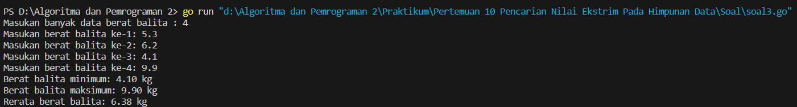

<h1 align="center" > Laporan Praktikum Modul10 X Pencarian Nilai Ekstrim Pada Himpunan Data</h1>

___

<p align="center">Julian Saputra - 103112400260</p>

___

Soal 1 : 
```go
package main

  

import "fmt"

  

func main() {

    var n int

    fmt.Print("Masukkan jumlah anak kelinci: ")

    fmt.Scan(&n)

  

    if n <= 0 || n > 1000 {

        fmt.Println("Jumlah kelinci harus antara 1 hingga 1000.")

        return

    }

  

    berat := make([]float64, n)

  

    fmt.Println("Masukkan berat masing-masing anak kelinci:")

    for i := 0; i < n; i++ {

        fmt.Scan(&berat[i])

    }

  

    min := berat[0]

    max := berat[0]

  

    for i := 1; i < n; i++ {

        if berat[i] < min {

            min = berat[i]

        }

        if berat[i] > max {

            max = berat[i]

        }

    }

  

    fmt.Printf("Berat terkecil: %.2f\n", min)

    fmt.Printf("Berat terbesar: %.2f\n", max)

}
```

Output : 


___

Soal 2 : 
```go
package main

  

import "fmt"

  

func main() {

    var x, y int

    fmt.Scan(&x, &y)

  

    if x <= 0 || y <= 0 || x > 1000 {

        fmt.Println("Nilai x atau y tidak valid.")

        return

    }

  

    var ikan [1000]float64

    for i := 0; i < x; i++ {

        fmt.Scan(&ikan[i])

    }

  

    jumlahWadah := x / y

    if x%y != 0 {

        jumlahWadah++

    }

  

    var totalBerat [1000]float64

    var total float64

  

    for i := 0; i < x; i++ {

        idxWadah := i / y

        totalBerat[idxWadah] += ikan[i]

    }

  

    for i := 0; i < jumlahWadah; i++ {

        fmt.Printf("%.2f ", totalBerat[i])

        total += totalBerat[i]

    }

    fmt.Println()

  

    rata := total / float64(jumlahWadah)

    fmt.Printf("%.2f\n", rata)

}
```

Output : 


___

Soal 3 :
```go
package main

  

import "fmt"

  

type arrBalita [100]float64

  

func hitungMinMax(arrBerat arrBalita, jumlah int, bMin *float64, bMax *float64) {

    *bMin = arrBerat[0]

    *bMax = arrBerat[0]

  

    for i := 1; i < jumlah; i++ {

        if arrBerat[i] < *bMin {

            *bMin = arrBerat[i]

        }

        if arrBerat[i] > *bMax {

            *bMax = arrBerat[i]

        }

    }

}

  

func rataRata(arrBerat arrBalita, jumlah int) float64 {

    var total float64

    for i := 0; i < jumlah; i++ {

        total += arrBerat[i]

    }

    return total / float64(jumlah)

}

  

func main() {

    var berat arrBalita

    var n int

  

    fmt.Print("Masukan banyak data berat balita : ")

    fmt.Scan(&n)

  

    for i := 0; i < n; i++ {

        fmt.Printf("Masukan berat balita ke-%d: ", i+1)

        fmt.Scan(&berat[i])

    }

  

    var min, max float64

    hitungMinMax(berat, n, &min, &max)

    rata := rataRata(berat, n)

  

    fmt.Printf("Berat balita minimum: %.2f kg\n", min)

    fmt.Printf("Berat balita maksimum: %.2f kg\n", max)

    fmt.Printf("Rerata berat balita: %.2f kg\n", rata)

}
```

Output : 


