---
<p align="center">Julian Saputra - 103112400260</p>

## Soal latihan modul 2A
---
Soal 1
```go
package main  <br>import “fmt”  <br>func main() {  <br>var (  <br>satu, dua, tiga string  <br>temp string  <br>)  <br>fmt.Print("Masukan input string: ")  <br>fmt.Scanln(&satu)  <br>fmt.Print("Masukan input string: ")  <br>fmt.Scanln(&dua)  <br>fmt.Print("Masukan input string: ")  <br>fmt.Scanln(&tiga)  <br>fmt.Println("Output awal = " + satu + " " + dua + " " + tiga)  <br>temp = satu  <br>satu = dua  <br>dua = tiga  <br>tiga = temp  <br>fmt.Println("Output akhir = " + satu + " " + dua + " " + tiga)  <br>}|
```

Output
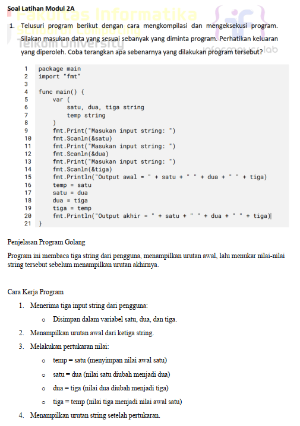

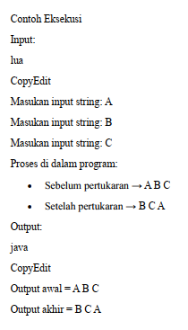

Soal 2

```go
package main

  

import "fmt"

  

func main() {

    var tahun int
    fmt.Print("Masukkan tahun: ")

    fmt.Scanln(&tahun)

  

    if (tahun%400 == 0) || (tahun%4 == 0 && tahun%100 != 0) {

        fmt.Println("Kabisat: true")

    } else {

        fmt.Println("Kabisat: false")

    }

}
```

Output 
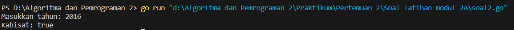

Soal 3 
```go
package main

  

import "fmt"

  

func main() {

    var r float64

  

    fmt.Print("Masukkan jari-jari: ")

    fmt.Scanln(&r)

  

    volume := (4.0 / 3.0) * 3.14 * (r * r * r)

    luas := 4 * 3.14 * (r * r)

  

    fmt.Println("Volume:", volume)

    fmt.Println("Luas Permukaan:", luas)

}
```

Output 
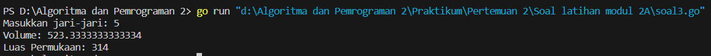

Soal 4
```go
package main

  

import "fmt"

  

func main() {

    var celsius float64

  

    fmt.Print("Masukkan temperatur Celsius: ")

    fmt.Scanln(&celsius)

  

    reamur := celsius * 4 / 5

    fahrenheit := (celsius * 9 / 5) + 32

    kelvin := celsius + 273

  

    fmt.Println("Derajat Reamur:", reamur)

    fmt.Println("Derajat Fahrenheit:", fahrenheit)

    fmt.Println("Derajat Kelvin:", kelvin)

}
```

Output
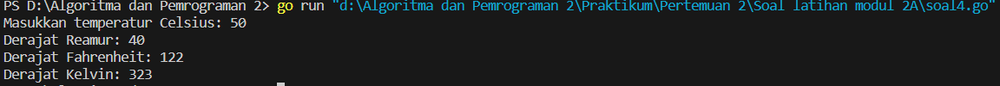

Soal 5
```go
package main

  

import "fmt"

  

func main() {

    var num1, num2, num3, num4, num5 int

    var char1, char2, char3 byte

  

    fmt.Print("Masukkan 5 angka ASCII: ")

    fmt.Scanln(&num1, &num2, &num3, &num4, &num5)

  

    fmt.Print("Masukkan 3 karakter: ")

    fmt.Scanf("%c%c%c", &char1, &char2, &char3)

  

    fmt.Printf("Karakter ASCII: %c %c %c %c %c\n", num1, num2, num3, num4, num5)

  

    fmt.Printf("Karakter setelahnya: %c%c%c\n", char1+1, char2+1, char3+1)

}
```

Output
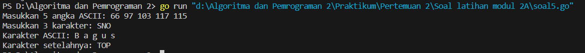

## Soal latihan modul 2B
---
Soal 1 
```go
package main

  

import "fmt"

  

func main() {

    var warnaBenar1, warnaBenar2, warnaBenar3, warnaBenar4 string

    warnaBenar1, warnaBenar2, warnaBenar3, warnaBenar4 = "merah", "kuning", "hijau", "ungu"

  

    var berhasil = true

  

    for i := 1; i <= 5; i++ {

        var w1, w2, w3, w4 string

        fmt.Printf("Percobaan %d: ", i)

        fmt.Scan(&w1, &w2, &w3, &w4)

  

        if w1 != warnaBenar1 || w2 != warnaBenar2 || w3 != warnaBenar3 || w4 != warnaBenar4 {

            berhasil = false

        }

    }

  

    fmt.Println("BERHASIL:", berhasil)

}
```

Output 
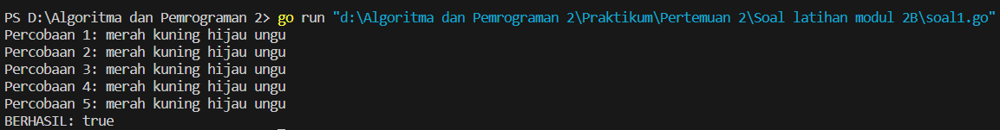

Soal 2
```go
package main

  

import "fmt"

  

func main() {

    var n int

    fmt.Print("N: ")

    fmt.Scan(&n)

  

    var pita string

    for i := 0; i < n; i++ {

        var bunga string

        fmt.Printf("Bunga %d: ", i+1)

        fmt.Scan(&bunga)

  

        if i == 0 {

            pita = bunga

        } else {

            pita += " - " + bunga

        }

    }

  

    fmt.Println("Pita:", pita)

}
```

Output
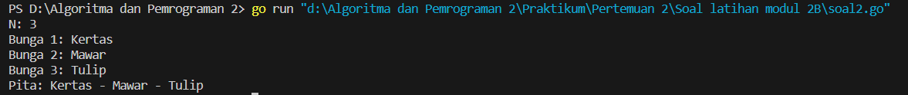

Soal 3 
```go
package main

  

import "fmt"

  

func main() {

    var kantongKiri, kantongKanan float64

  

    for {

        var beratKiri, beratKanan float64

        fmt.Print("Masukan berat belanjaan di kedua kantong: ")

        fmt.Scan(&beratKiri, &beratKanan)

  

        kantongKiri += beratKiri

        kantongKanan += beratKanan

  

        selisih := kantongKiri - kantongKanan

        if selisih < 0 {

            selisih = -selisih

        }

  

        if selisih >= 9 {

            fmt.Println("Sepeda motor Pak Andi akan oleng: true")

        }

  

        if kantongKiri > 150 || kantongKanan > 150 {

            fmt.Println("Kantong melebihi batas! Proses berhenti.")

            break

        }

    }

  

    fmt.Println("Proses selesai.")

}
```

Output 
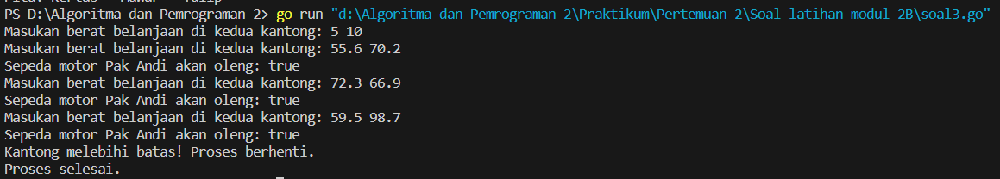

Soal 4 
```go
package main

  

import "fmt"

  

func calculateF(k int) float64 {

    return float64((4*k + 2) * (4*k + 2)) / float64((4*k + 1) * (4*k + 3))

}

  

func approximateSqrt2(k int) float64 {

    result := 1.0

    for i := 0; i < k; i++ {

        result = (result + 2/result) / 2

    }

    return result

}

  

func main() {

    var k int

    fmt.Print("Masukkan nilai K: ")

    fmt.Scan(&k)

  

    fK := calculateF(k)

    fmt.Printf("Nilai f(K) = %.10f\n", fK)

  

    sqrt2 := approximateSqrt2(k)

    fmt.Printf("Nilai aproksimasi akar 2 = %.10f\n", sqrt2)

}
```

Output
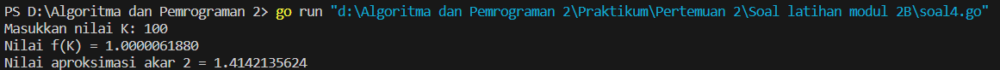

## Soal latihan modul 2C
---
Soal 1 
```go
package main

  

import "fmt"

  

func main() {

    var berat int

    fmt.Print("Masukkan berat parsel (gram): ")

    fmt.Scan(&berat)

  

    kg := berat / 1000  

    sisaGram := berat % 1000

  

    biaya := kg * 10000

  

    if berat > 10000 {

        sisaGram = 0

    }

  

    if sisaGram > 0 {

        if sisaGram >= 500 {

            biaya += sisaGram * 15

        } else {

            biaya += sisaGram * 5

        }

    }

  

    fmt.Println("Detail berat:", kg, "kg +", sisaGram, "gr")

    fmt.Println("Total biaya: Rp.", biaya)

}
```

Output 
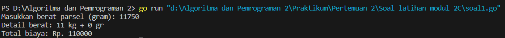

Soal 2 
```go
|package main  <br>import “fmt”  <br>func main() {  <br>var nam float64  <br>var nmk string  <br>fmt.Print(“Nilai akhir mata kuliah: “)  <br>fmt.Scanln(&nam)  <br>if nam > 80 {  <br>nam = “A”  <br>}  <br>if nam > 72.5 {  <br>nam = “AB”  <br>}  <br>if nam > 65 {  <br>nam = “B”  <br>}  <br>if nam > 57.5 {  <br>nam = “BC”  <br>}  <br>if nam > 50 {  <br>nam = “C”  <br>}  <br>if nam > 40 {  <br>nam = “D”  <br>} else if nam <= 40 {  <br>nam = “E”  <br>}  <br>fmt.Println(“Nilai mata kuliah: “, nmk)  <br>}|
```

Output 
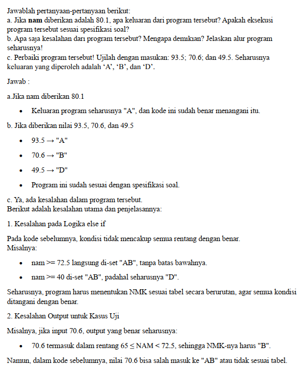
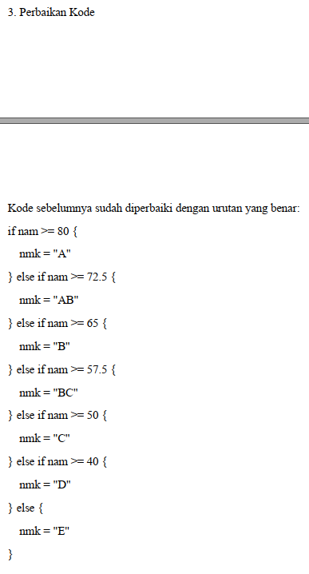

Soal 3 
```go
package main

  

import "fmt"

  

func main() {

    var b int

    fmt.Print("Masukkan bilangan: ")

    fmt.Scan(&b)

  

    fmt.Print("Faktor: ")

    jumlahFaktor := 0

    for i := 1; i <= b; i++ {

        if b%i == 0 {

            fmt.Print(i, " ")

            jumlahFaktor++

        }

    }

    fmt.Println()

  

    isPrima := jumlahFaktor == 2

    fmt.Println("Prima:", isPrima)

}
```

Output 
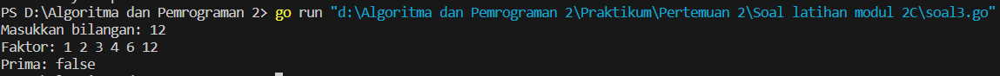
