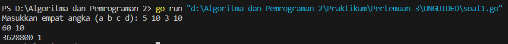
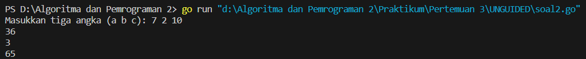
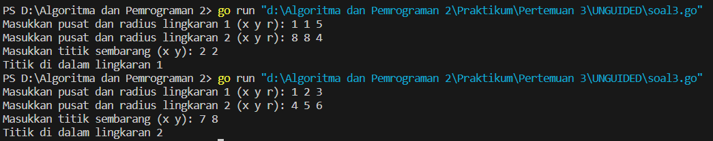

<h1 align="center" > Laporan Praktikum Modul 3 X Fungsi</h1>
___
<p align="center">Julian Saputra - 103112400260</p>
___
Soal 1 : 
```go
package main
import "fmt"

func factorial(n int) int {
    result := 1
    for i := 1; i <= n; i++ {
        result *= i
    }
    return result
}

func permutation(n, r int) int {
    if n < r {
        return 0
    }
    return factorial(n) / factorial(n-r)
}

func combination(n, r int) int {
    if n < r {
        return 0
    }
    return factorial(n) / (factorial(r) * factorial(n-r))
}

func main() {
    var a, b, c, d int
    fmt.Print("Masukkan empat angka (a b c d): ")
    fmt.Scan(&a, &b, &c, &d)
    
    P_ac := permutation(a, c)
    C_ac := combination(a, c)  
    fmt.Println(P_ac, C_ac)

    P_bd := permutation(b, d)
    C_bd := combination(b, d)
    fmt.Println(P_bd, C_bd)
}
```

Output


___

Soal 2 :
```go
package main
import "fmt"

func f(x int) int {
    return x * x
}

func g(x int) int {
    return x - 2
}

func h(x int) int {
    return x + 1
}

func faktorial(n int) int {
    if n == 0 || n == 1 {
        return 1
    }
    hitung := 1
    for i := 2; i <= n; i++ {
        hitung *= i
    }
    return hitung
}

func main() {
    var a, b, c int
    fmt.Print("Masukkan tiga angka (a b c): ")
    fmt.Scan(&a, &b, &c)

    fogog := f(g(h(a)))
    fmt.Println(fogog)

    gohof := g(h(f(b)))
    fmt.Println(gohof)
    
    hofog := h(f(g(c)))
    fmt.Println(hofog)
}
```

Output 


___

Soal 3 : 
```go
package main
import "fmt"

func dalamLingkaran(cx, cy, r, x, y int) bool {
    dx := x - cx
    dy := y - cy
    return dx*dx+dy*dy <= r*r
}

func main() {
    var x1, y1, r1 int
    var x2, y2, r2 int
    var x, y int
    fmt.Print("Masukkan pusat dan radius lingkaran 1 (x y r): ")
    fmt.Scan(&x1, &y1, &r1)

    fmt.Print("Masukkan pusat dan radius lingkaran 2 (x y r): ")
    fmt.Scan(&x2, &y2, &r2)
    
    fmt.Print("Masukkan titik sembarang (x y): ")
    fmt.Scan(&x, &y)

    diDalam1 := dalamLingkaran(x1, y1, r1, x, y)
    diDalam2 := dalamLingkaran(x2, y2, r2, x, y)

    if diDalam1 && diDalam2 {
        fmt.Println("Titik di dalam lingkaran 1 dan 2")
    } else if diDalam1 {
        fmt.Println("Titik di dalam lingkaran 1")
    } else if diDalam2 {
        fmt.Println("Titik di dalam lingkaran 2")
    } else {
        fmt.Println("Titik di luar lingkaran 1 dan 2")
    }
}
```

Output


