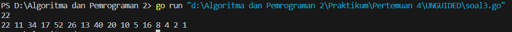

<h1 align="center" > Laporan Praktikum Modul 4 X Prosedur</h1>
___
<p align="center">Julian Saputra - 103112400260</p>
___

Soal 1 :
```go
package main

import "fmt"

func factorial(n int) int {
    if n == 0 {
        return 1
    }
    result := 1
    for i := 1; i <= n; i++ {
        result *= i
    }
    return result
}

func permutation(n, r int) int {
    if r > n {
        return 0
    }
    return factorial(n) / factorial(n-r)
}

func combination(n, r int) int {
    if r > n {
        return 0
    }
    return factorial(n) / (factorial(r) * factorial(n-r))
}

func main() {
    var a, b, c, d int
    fmt.Scan(&a, &b, &c, &d)

    P1 := permutation(a, c)
    C1 := combination(a, c)
    P2 := permutation(b, d)
    C2 := combination(b, d)

    fmt.Println(P1, C1)
    fmt.Println(P2, C2)
}
```

Output :


___

Soal 2 : 

```go
package main

import "fmt"

func hitungSkor(waktu [8]int) (int, int) {
    soal, totalWaktu := 0, 0

    for _, w := range waktu {
        if w <= 300 {
            soal++
            totalWaktu += w
        }
    }
    return soal, totalWaktu
}

func main() {
    var nama, pemenang string
    var waktu [8]int
    var soal, skor, maxSoal, minWaktu int
    maxSoal, minWaktu = -1, 301

    for {
        fmt.Scan(&nama)
        if nama == "Selesai" {
            break
        }
        
        for i := 0; i < 8; i++ {
            fmt.Scan(&waktu[i])
        }
        soal, skor = hitungSkor(waktu)
        if soal > maxSoal || (soal == maxSoal && skor < minWaktu) {
            maxSoal = soal
            minWaktu = skor
            pemenang = nama
        }
    }

    fmt.Println(pemenang, maxSoal, minWaktu)
}
```

Output : 


___

Soal 3 : 
```go
package main

import "fmt"

func cetakDeret(n int) {
    for n != 1 {
        fmt.Print(n, " ")
        if n%2 == 0 {
            n = n / 2
        } else {
            n = 3*n + 1
        }
    }
    fmt.Println(n)
}

func main() {
    var n int
    fmt.Scan(&n)

    cetakDeret(n)
}
```

Output : 


