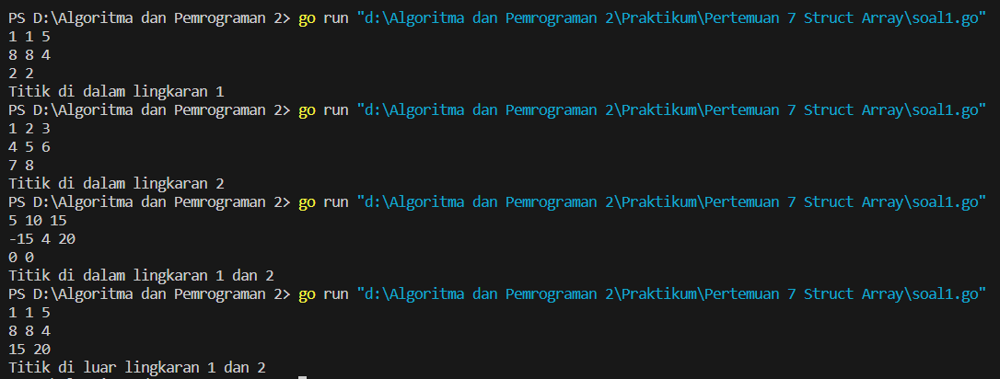
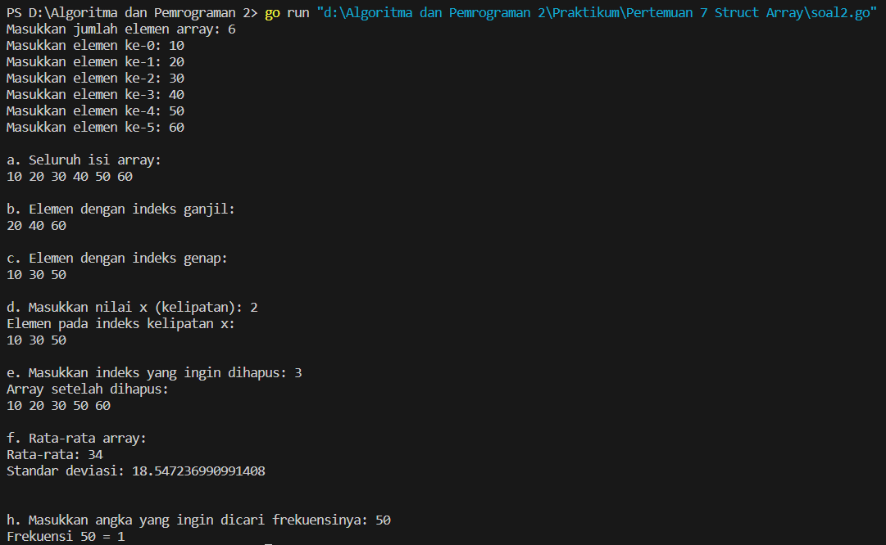
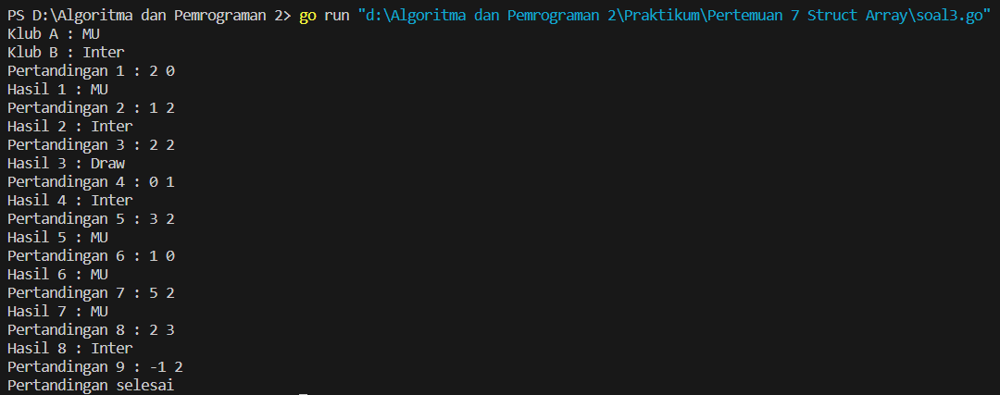
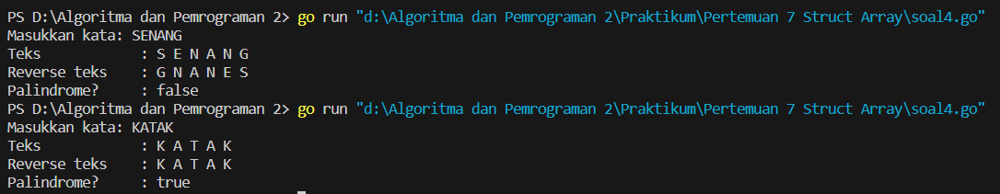

<h1 align="center" > Laporan Praktikum Modul 7 X Struct Array</h1>

___

<p align="center">Julian Saputra - 103112400260</p>

___

Soal 1 :
```go
package main

  

import (

    "fmt"

    "math"

)

  

type Titik struct {

    x, y int

}

  

type Lingkaran struct {

    pusat  Titik

    radius int

}

  

func jarak(p, q Titik) float64 {

    return math.Sqrt(math.Pow(float64(p.x-q.x), 2) + math.Pow(float64(p.y-q.y), 2))

}

  

func didalam(c Lingkaran, p Titik) bool {

    return jarak(c.pusat, p) <= float64(c.radius)

}

  

func main() {

    var c1, c2 Lingkaran

    var p Titik

  

    fmt.Scan(&c1.pusat.x, &c1.pusat.y, &c1.radius)

  

    fmt.Scan(&c2.pusat.x, &c2.pusat.y, &c2.radius)

  

    fmt.Scan(&p.x, &p.y)

  

    in1 := didalam(c1, p)

    in2 := didalam(c2, p)

  

    if in1 && in2 {

        fmt.Println("Titik di dalam lingkaran 1 dan 2")

    } else if in1 {

        fmt.Println("Titik di dalam lingkaran 1")

    } else if in2 {

        fmt.Println("Titik di dalam lingkaran 2")

    } else {

        fmt.Println("Titik di luar lingkaran 1 dan 2")

    }

}
```

Output : 


___

Soal 2 : 
```go
package main

  

import (

    "fmt"

    "math"

)

  

func main() {

    var n int

    fmt.Print("Masukkan jumlah elemen array: ")

    fmt.Scan(&n)

  

    var array [100]int

    for i := 0; i < n; i++ {

        fmt.Printf("Masukkan elemen ke-%d: ", i)

        fmt.Scan(&array[i])

    }

  

    fmt.Println("\na. Seluruh isi array:")

    for i := 0; i < n; i++ {

        fmt.Print(array[i], " ")

    }

  

    fmt.Println("\n\nb. Elemen dengan indeks ganjil:")

    for i := 1; i < n; i += 2 {

        fmt.Print(array[i], " ")

    }

  

    fmt.Println("\n\nc. Elemen dengan indeks genap:")

    for i := 0; i < n; i += 2 {

        fmt.Print(array[i], " ")

    }

  

    var x int

    fmt.Print("\n\nd. Masukkan nilai x (kelipatan): ")

    fmt.Scan(&x)

    fmt.Println("Elemen pada indeks kelipatan x:")

    for i := 0; i < n; i++ {

        if i%x == 0 {

            fmt.Print(array[i], " ")

        }

    }

  

    var del int

    fmt.Print("\n\ne. Masukkan indeks yang ingin dihapus: ")

    fmt.Scan(&del)

  

    if del >= 0 && del < n {

        for i := del; i < n-1; i++ {

            array[i] = array[i+1]

        }

        n--

  

        fmt.Println("Array setelah dihapus:")

        for i := 0; i < n; i++ {

            fmt.Print(array[i], " ")

        }

    } else {

        fmt.Println("Indeks tidak valid.")

    }

  

    fmt.Println("\n\nf. Rata-rata array:")

    var total int = 0

    for i := 0; i < n; i++ {

        total += array[i]

    }

    rata := float64(total) / float64(n)

    fmt.Println("Rata-rata:", rata)

  

    var jumlah float64 = 0

    for i := 0; i < n; i++ {

        selisih := float64(array[i]) - rata

        jumlah += selisih * selisih

    }

    stddev := math.Sqrt(jumlah / float64(n))

    fmt.Println("Standar deviasi:", stddev)

  

    var cari int

    fmt.Print("\n\nh. Masukkan angka yang ingin dicari frekuensinya: ")

    fmt.Scan(&cari)

  

    frek := 0

    for i := 0; i < n; i++ {

        if array[i] == cari {

            frek++

        }

    }

    fmt.Println("Frekuensi", cari, "=", frek)

}
```

Output : 


___

Soal 3 :
```go
package main

  

import (

    "fmt"

)

  

func main() {

    var klubA, klubB string

    fmt.Print("Klub A : ")

    fmt.Scanln(&klubA)

    fmt.Print("Klub B : ")

    fmt.Scanln(&klubB)

  

    var pemenang []string

    pertandingan := 1

  

    for {

        var skorA, skorB int

        fmt.Printf("Pertandingan %d : ", pertandingan)

        fmt.Scan(&skorA, &skorB)

  

        if skorA < 0 || skorB < 0 {

            break

        }

  

        if skorA > skorB {

            fmt.Printf("Hasil %d : %s\n", pertandingan, klubA)

            pemenang = append(pemenang, klubA)

        } else if skorB > skorA {

            fmt.Printf("Hasil %d : %s\n", pertandingan, klubB)

            pemenang = append(pemenang, klubB)

        } else {

            fmt.Printf("Hasil %d : Draw\n", pertandingan)

            pemenang = append(pemenang, "Draw")

        }

        pertandingan++

    }

  

    fmt.Println("Pertandingan selesai")

}
```

Output : 


___

Soal 4 :
```go
package main

  

import (

    "fmt"

)

  

func isPalindrome(text []rune) bool {

    n := len(text)

    for i := 0; i < n/2; i++ {

        if text[i] != text[n-1-i] {

            return false

        }

    }

    return true

}

  

func main() {

    var input string

    fmt.Print("Masukkan kata: ")

    fmt.Scanln(&input)

  

    runes := []rune(input)

  

    fmt.Print("Teks\t\t: ")

    for _, r := range runes {

        fmt.Printf("%c ", r)

    }

    fmt.Println()

  

    fmt.Print("Reverse teks\t: ")

    for i := len(runes) - 1; i >= 0; i-- {

        fmt.Printf("%c ", runes[i])

    }

    fmt.Println()

  

    if isPalindrome(runes) {

        fmt.Println("Palindrome?\t: true")

    } else {

        fmt.Println("Palindrome?\t: false")

    }

}
```

Output : 


